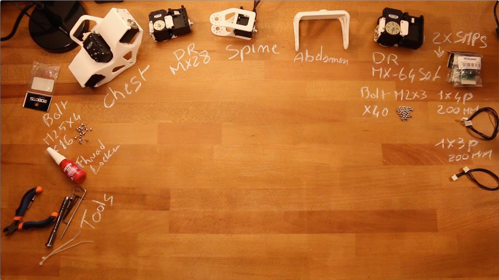

# 5 DoFs Multi-articulated Trunk assembly instructions

## 1- Build Sub-assemblies

First you need to assemble several sub-assemblies which will be combined to create the 5 DoFs Multi-articulated trunk.

The following instructions will guide you in this assembling process:

- **1.1- [Double MX64 assembly](../../robotis_library/doc/double_MX64_assembly.md)**
- **1.2- [Double MX28 assembly](../../robotis_library/doc/double_MX28_assembly.md)**
- **1.3- [Spine assembly](subassembly/chest_assembly_instrucions.md)**
- **1.4- [Chest assembly](subassembly/chest_assembly_instructions.md)**

## 2- Multi-articulated trunk assembly

- Preparation: 10 min
- Assembly: 30-35 min

### Requirements

**Sub-assemblies**:
- Chest
- Double rotation MX28
- Spine
- Double rotation MX64

**3D printed parts**:
- Abdomen

**Cables**:
- 1x 4P 200mm
- 1x 3P 200mm

**Robotis parts:**
- 2x HN07-N102
- 2x SMPS2Dynamixel
- 40x Bolts M2x3
- 16x Bolts M2.5x4

**Motor configuration:**
- 1x Alimentation 12V
- 1x USB2Dynamixel or USB2AX
- A computer...

## Video instructions:

