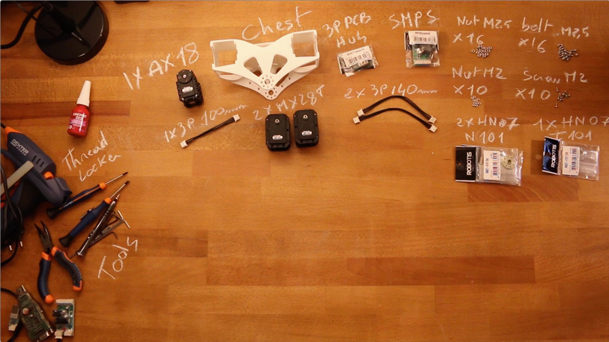

# Chest assembly instructions

Photo

- Preparation: 10-15 min
- Assembly: 30-45 min

## Requirement:

**3D Printed parts**:
- Chest

**Actuators:**
- 1x Robotis Dynamixel AX12-A (or AX18-A)
- 2x Robotis Dynamixel MX28-AT (or MX28-T)

**Cables**:
- 1x 3P 100mm
- 2x 3P 140mm

**Robotis parts:**
- 2x HN07-N102
- 1x Bioloid 3P PCB HUB
- 1x SMPS2Dynamixel
- 16x Nuts M2.5
- 16x Bolts M2.5
- 10x Nuts M2
- 10x Screws M2

**Motor configuration:**
- 1x Alimentation 12V
- 1x USB2Dynamixel or USB2AX
- A computer...

## Video instructions:

